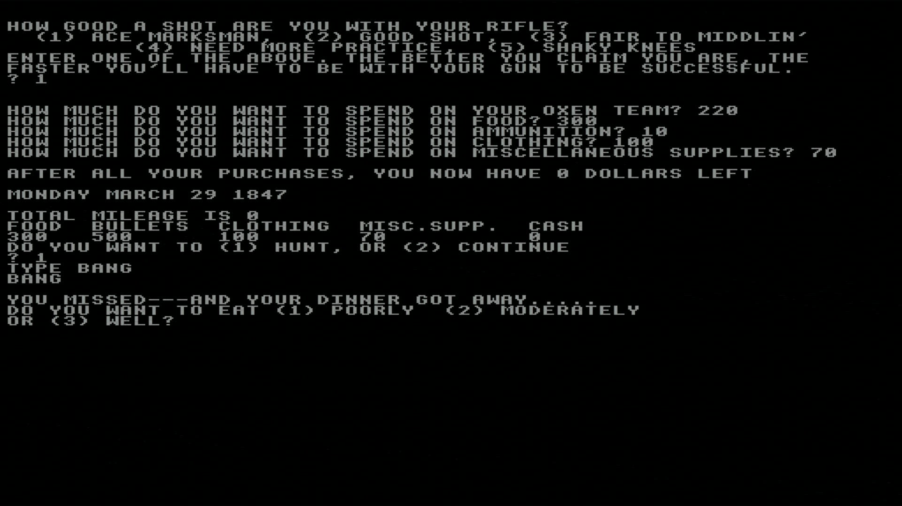

# Agon-OregonTrail
Oregon Trail for the Agon Light (TM) 8-bit computer https://www.thebyteattic.com/p/agon.html  
(Dang, totally missed the opportunity to call the repo "OrAgon Trail")

#### How to install and run:  
* Download the two files "INTRO.BBC" and "GAME.BBC" 
* Copy both files to SD card, insert in Agon Light, powerup.  
* In BBC Basic, type:

        LOAD "INTRO"
        RUN

#### How it was made:  
* Original source http://bbcmicro.co.uk/explore.php?id=2716 - "explore disk"
* Go to INTRO file and "Download"
* Go to GAME file and "Download"
* Open each file in http://www.bbcbasic.co.uk/bbcsdl/index.html (note you have to select "any file" because they are *.bin)
*chaneg mode to 0 in line 140 of INTRO
* In each file, delete  occurences of "*FX15" (in line 140 and 681, and in 6040 respectively)
* Save each file as "*.BBC"

#### Screenshot:
 

https://www.youtube.com/watch?v=HMaCa89KopY

